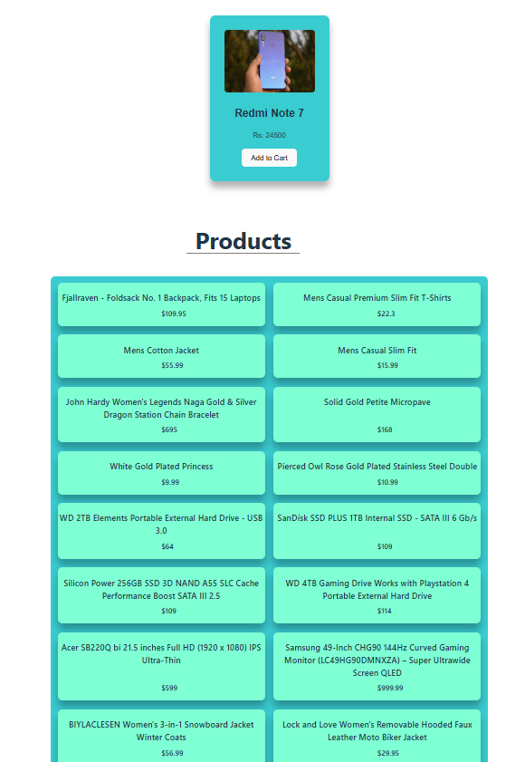
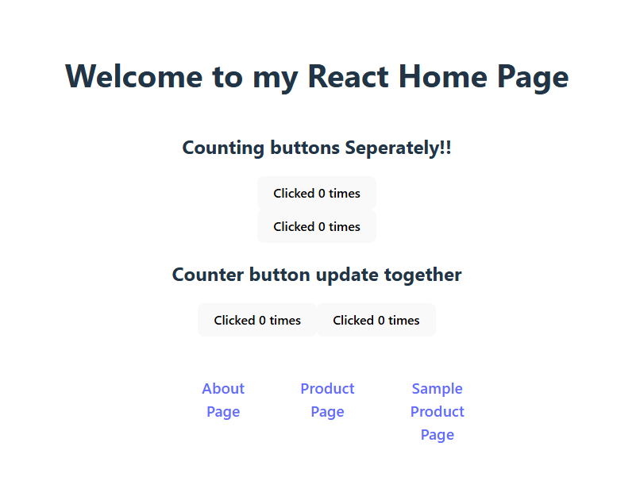
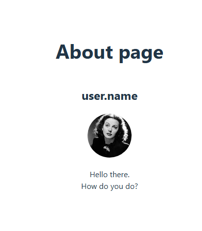
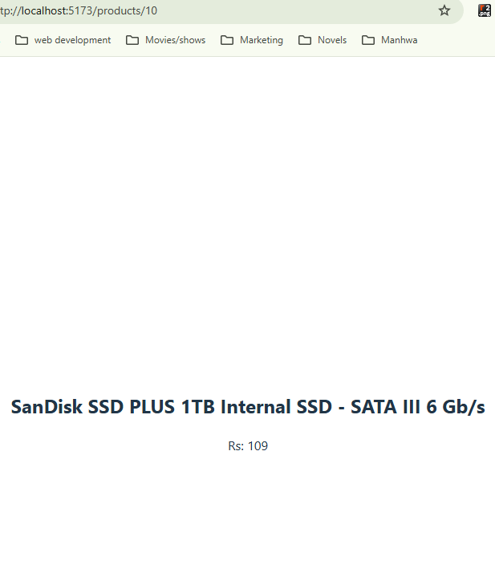

# My React Practice Project

This is a practice React project where I learned:

- How to create React components
- Using props and JSX
- Styling components with CSS
- Mapping arrays to display lists
- Managing state with hooks
- Fetching and displaying API data
- Basic routing and conditional rendering

---

## Learning Progress

### 🟢 Day 2 — Hooks & Side Effects

On Day 2, I learned how to handle side effects in React.

- Used `useEffect` hook
- Learned about the dependency array
- Fetched product data from FakeStore API
- Managed loading and error states
- Used `async/await` for API calls

Key understanding:

- `useEffect` runs after render
- Dependency array controls when it runs
- Empty array (`[]`) runs the effect only once

---

### 🟢 Day 3 — Routing & Conditional Rendering

On Day 3, I learned how to structure a real React application.

- Set up React Router DOM
- Used `BrowserRouter`, `Routes`, and `Route`
- Created a Home page
- Moved UI logic from `App.jsx` to page components
- Practiced conditional rendering:
  - Loading message
  - No data found message

Key understanding:

- Real apps use pages, not a single component
- `App.jsx` should manage routes
- Conditional rendering improves user experience

---

### 🟢 Day 4 — JavaScript for Frontend Interviews

On Day 4, I focused on important JavaScript concepts.

- `map()` for rendering UI lists
- `filter()` for showing selected data
- `reduce()` for calculating totals
- `forEach()` for side effects
- Spread operator (`...`) for arrays and objects
- Destructuring
- Promises with `.then()` and `.catch()`
- `async/await` for clean asynchronous code

Key understanding:

- `map()` returns a new array, `forEach()` does not
- Promises represent future values
- `async/await` is easier to read than `.then()`

---

## Components

- **Button.jsx**  
  A reusable button component that demonstrates event handling and state updates.

- **ButtonS.jsx**  
  A separate button component with its own independent state, used to practice multiple state instances.

- **Product.jsx**  
  A basic product component used to display product-related information and understand props usage.

- **ProductCard.jsx**  
  Displays individual product details such as title, price, and image.  
  Also includes state-based interactions like an “Add to Cart” button.

- **ProductList.jsx**  
  Renders a list of products by mapping over an array of product data.  
  Uses JavaScript array methods like `map()` and `filter()`.

- **ProductDetail.jsx (Component)**  
  A reusable component that displays detailed information of a single product.  
  Designed to be used inside pages or routed views.

---

## Pages

- **Home.jsx**  
  The main landing page of the application.  
  Combines multiple components and provides navigation links to other pages.

- **About.jsx**  
  A simple page that provides information about the application and its purpose.

- **Products.jsx**  
  Displays a list of available products.  
  Uses `ProductList` component and demonstrates data rendering and conditional UI.

- **ProductDetail.jsx (Page)**  
  A page-level component used to show details of a specific product.  
  Typically accessed via routing and can use URL parameters (`useParams`).

---

---

## Project Output

### Image 1

### Image 2

### Image 3

### Image 4

### Image 5

### Image 6

---

## Notes

This project helped me build a strong foundation in React and modern JavaScript.  
It prepares me for more advanced topics like routing, API integration, and real-world frontend development.
=======
